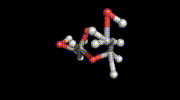
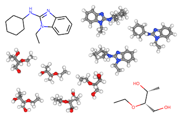

# 📢 News 
**[NEWS]** Please check our latest work on molecular conformation generation, which has been accepted in ICML'2021 (Long Talk): [Learning Gradient Fields for Molecular Conformation Generation](https://arxiv.org/abs/2105.03902). [[Code](https://github.com/DeepGraphLearning/ConfGF)]



-----


# CGCF for Conformation Generation



[[OpenReview](https://openreview.net/forum?id=pAbm1qfheGk)] [[arXiv](https://arxiv.org/abs/2102.10240)] [[Code](https://github.com/MinkaiXu/CGCF-ConfGen)]

This is the official code repository of our ICLR paper "Learning Neural Generative Dynamics for Molecular Conformation Generation" (2021).

## Installation

### Install via Conda (Recommended)

Step 1: Create a conda environment named `CGCF` from `env.yml` :

```bash
conda env create --file env.yml
```

Step 2: Install PyTorch Geometric :

```bash
conda activate CGCF
./install_torch_geometric.sh
```

### Install Manually

```bash
# Create conda environment
conda create --name CGCF python=3.7

# Activate the environment
conda activate CGCF

# Install packages
conda install pytorch==1.6.0 torchvision==0.7.0 cudatoolkit=10.1 -c pytorch
conda install rdkit==2020.03.3 -c rdkit
conda install tqdm networkx scipy scikit-learn h5py tensorboard -c conda-forge
pip install torchdiffeq==0.0.1

# Install PyTorch Geometric
pip install --no-index torch-scatter -f https://pytorch-geometric.com/whl/torch-1.6.0+cu101.html
pip install --no-index torch-sparse -f https://pytorch-geometric.com/whl/torch-1.6.0+cu101.html
pip install --no-index torch-cluster -f https://pytorch-geometric.com/whl/torch-1.6.0+cu101.html
pip install --no-index torch-spline-conv -f https://pytorch-geometric.com/whl/torch-1.6.0+cu101.html
pip install torch-geometric
```

## Data

### Official Datasets

The official datasets are available [here](https://drive.google.com/drive/folders/1UTxgyWeXbgDehV1okdZ2UkKwZbe3I0hO?usp=sharing).

### Input Format / Make Your Own Datasets

The dataset file is a pickled Python list consisting of [``rdkit.Chem.rdchem.Mol``](https://www.rdkit.org/docs/source/rdkit.Chem.rdchem.html#rdkit.Chem.rdchem.Mol) objects. Each conformation is stored individually as a `Mol` object. For example, if a dataset contains 3 molecules, where the first molecule has 4 conformations, the second one and the third one have 5 and 6 conformations respectively, then the pickled Python list will contain 4+5+6 `Mol` objects in total.

### Output Format

The output format is identical to the input format.

## Usage

### Generate Conformations

Example: generating 50 conformations for each molecule in the QM9 test-split with the pre-trained model.

```bash
python generate.py --ckpt ./pretrained/ckpt_qm9.pt --dataset ./data/qm9/test.pkl --num_samples 50 --out ./generated.pkl
```

More generation options can be found in `generate.py`.

### Train

Example: training a model for QM9 molecules.

```bash
python train.py --train_dataset ./data/qm9/train.pkl --val_dataset ./data/qm9/val.pkl
```

More training options can be found in `train.py`.

## Citation

Please consider citing our work if you find it helpful.

```
@inproceedings{
  xu2021learning,
  title={Learning Neural Generative Dynamics for Molecular Conformation Generation},
  author={Minkai Xu* and Shitong Luo* and Yoshua Bengio and Jian Peng and Jian Tang},
  booktitle={International Conference on Learning Representations},
  year={2021},
  url={https://openreview.net/forum?id=pAbm1qfheGk}
}
```

## Contact

If you have any question, please contact me at <minkai.xu@umontreal.ca> or <xuminkai@mila.quebec>.

## Updates

- Feb 4, 2021. Code is coming soon.
- Feb 20, 2021. Code is released.

